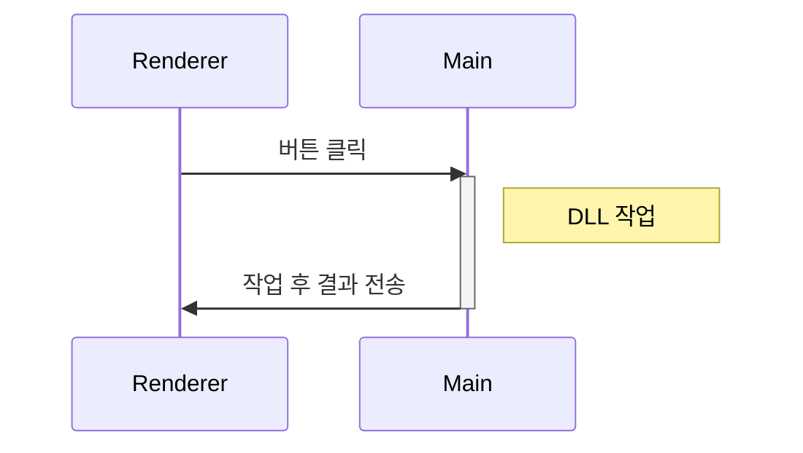
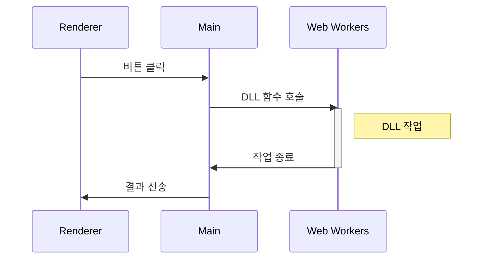
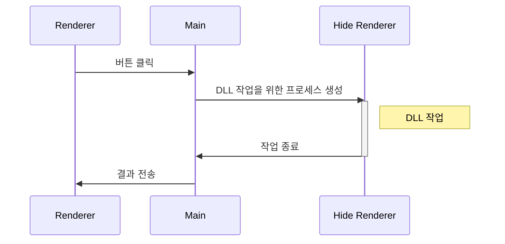

> Electron 기반의 데스크톱 애플리케이션에서 DLL을 사용하여 작업을 할 때 오래 걸리는 작업일 경우 작업이 완료되기 전까지 애플리케이션이 멈춘다.
> 어떻게 하면 DLL 작업을 하는 동안 애플리케이션이 멈추지 않고 계속 동작을 할까?

- Node.js에서 DLL모듈 사용하는 방법(https://licking-code.tistory.com/27)

```javascript
const ffi = require('ffi')

// DLL 모듈을 로드합니다.
const myDll = ffi.Library('path/to/your/dll', {
  'functionName': ['returnType', ['parameterType1', 'parameterType2', ...]]
})

// DLL 모듈의 함수를 호출합니다.
const result = myDll.functionName(param1, param2, ...)
```

## 1. 과정

### 1) 첫 번째 시도

Electron은 Chromium의 다중 프로세스 아키텍처처럼 Main 프로세스와 Renderer 프로세스로 이루어져 있다.
Main 프로세스는 백그라운드 작업을 주로 하고 Renderer 프로세스는 UI와 관련되어 있기 때문에 Renderer 프로세스에서 버튼을 눌렀을 때 Main 프로세스에서 DLL을 사용하여 작업을 하고 완료한 결과를 Renderer 프로세스에 보내도록 했다.



하지만 결과는 Main 프로세스가 작업이 완료될 때까지 Renderer 프로세스도 같이 멈췄다.

### 2) 두 번째 시도

Web Workers API를 사용하여 백그라운드에서 DLL을 사용한 작업을 하도록 했다.



Main 프로세스에서 Web Workers를 사용하여 DLL 작업을 하는 동안 Renderer 프로세스가 멈추지는 않았다.

## 3. 이슈

DLL에서 함수를 가져다 쓸 때 에러 처리를 위해 try-catch 구문을 사용하고 에러가 발생 시 함수 리턴값을 약속하여 에러 처리를 하였지만 간헐적으로 DLL에서 작업을 하다 에러가 발생하여 죽는 경우 Main 프로세스가 같이 죽는 이슈가 발생했다.

클라이언트 개발자도 DLL에서 try-catch 구문으로 예외 처리를 해도 리턴값을 주기 전에 DLL이 죽었다. 이유는 다른 업체의 DLL 파일을 사용하기 때문에 정확히 알 수 없다고 하여 다른 방안을 생각해 보았다.

## 4. 해결

Main 프로세스에서 DLL 작업을 할 경우 Main 프로세스가 같이 죽는 경우가 발생하여 Main 프로세스가 아닌 별도의 Renderer 프로세스에서 DLL 작업을 하도록 했다.



별도의 Renderer 프로세스를 생성하고 DLL 작업만을 위한 프로세스기 때문에 UI는 보이지 않도록 숨겼다. Renderer 프로세스 간에는 서로 데이터를 주고받을 수 없어 Main 프로세스를 통해 데이터를 주고받았다.

DLL 작업 도중 죽는 에러가 발생하더라도 Renderer 프로세스가 죽기 때문에 애플리케이션 동작에는 문제가 없었다.

### 참고 사이트

- [프로세스 구조](https://www.electronjs.org/docs/latest/tutorial/process-model)
- [IPC 통신](https://www.electronjs.org/docs/latest/tutorial/ipc)